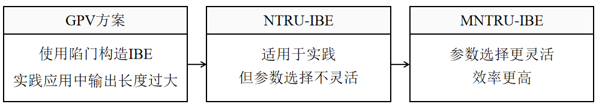
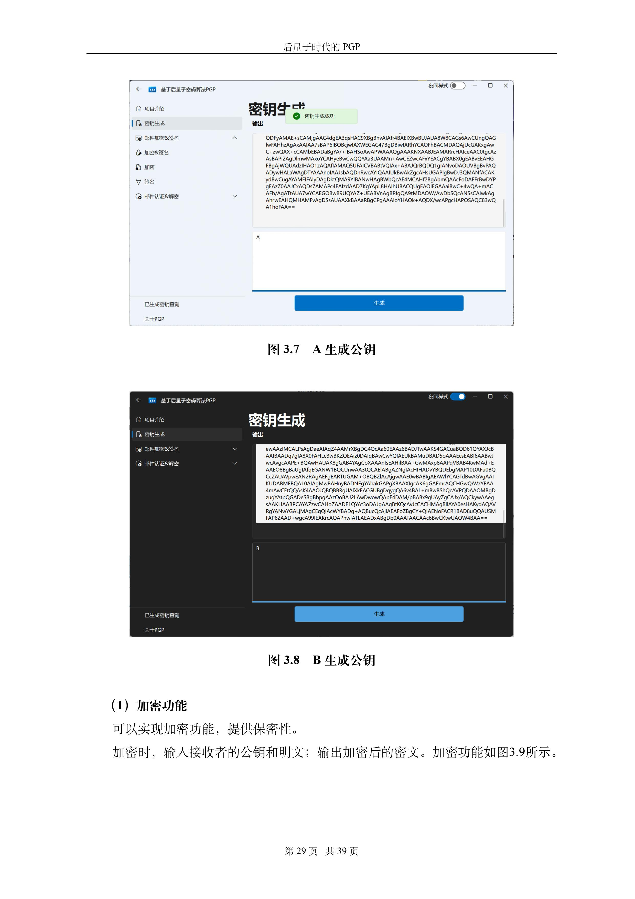

<<<<<<< HEAD
# 基于格密码和密钥复用的后量子邮件加密系统

## 本作品的工作

本作品采用上图所示的技术路线。主要工作如下：

（1）基于GPV方案[GPV08]，在Module-NTRU（MNTRU）格上实现了基于身份的加密系统IBE；

（2）基于PSST方案[PSST11b]，由IBE实现集成签名加密系统ISE；

（3）基于QT开发用户操作友好的后量子PGP软件。

接下来，将简要介绍本作品的工作:

### 实现基于格的 IBE

为了实现后量子安全，本作品使用格密码算法作为PQ-PGP的底层。在格上实现IBE时，本作品以GPV方案[GPV08]为起点，对比分析了NTRU格和Module-NTRU格上的IBE算法:

需要注意的是，GPV方案中的参数$m$较大，使得 IBE所产生的输出对于实际应用来说太长了。对此，Ducas等人 介绍了一种GPV陷门的变体\cite{DLP14}。该方案利用了NTRU格的计算困难性假设，对于多项式环$\mathcal{R}:=\mathbb{Z}[X]/\phi(X)$（其中首一多项式$\phi(X)\in \mathbb{Z}[X]$），新的陷门生成算法输出一对${h}_{\mathrm{NTRU}}\in\mathcal{R}_{q},\mathbf{T}_{\rm{NTRU}}=\mathcal{R}^{2\times 2}$，在$\mathcal{R}_{q}=\mathcal{R}/ q \mathcal{R}$上满足$(1, {h}_{\mathrm{NTRU}}) \cdot \mathbf{T}_{\mathrm{NTRU }}=0 \bmod q$。由于该方案的陷门生成算法基于多项式环，只需要$m=2n$（而非之前的$m={\Theta}(n\log{q})$)，因此相对于GPV的陷门生成更加高效。

尽管在NTRU格构造的IBE方案已经足够适用于实践，但是在参数的选取上仍然可以改进。出于安全性和高效性的需求，$\phi(X)$最广泛的选择是$X^{n}+1$，其中$n=2^{k},k \in \mathbb{Z}$。当希望获得更高的安全级别，由于$n$的特殊形式（2的幂次），参数的选择欠缺灵活性。例如，在\cite{DLP14}中分析道当环的维数$n=512$时可以提供80bits的安全性，当$n=1024$时可以提供192bits的安全性。在这种形况下，当人们希望得到中间级别的安全等级时，比如128bits，就只能选择$n=1024$的环，从而导致巨大的效率损失。

于是，类似于Ring-LWE的广泛概念Module-LWE[MLWR]， [CKKS19]提出了NTRU格的广泛概念：Module-NTRU（MNTRU）格。将$\mathcal{R}^{2}$中的NTRU格推广到高维$\mathcal{R}^{d}$中的MNTRU格，能够使得NTRU陷门的维数选择更加灵活，同时密钥规模更小、比特安全性更强、效率更高。

经过综合比对后，本作品选择在效率更高的MNTRU上实现IBE作为底层设计。密钥生成算法$\mathsf{KeyGen}$中，基于Module-NTRU假设，以MNTRU实例作为主公钥，接近正交的短格基$\mathbfit{T}_\mathrm{MNTRU}$作为主私钥；用户密钥提取算法$\mathsf{Extract}$中，在$\mathbf{T}_\mathrm{MNTRU}$上使用随机化最近平面算法，运行近似高斯采样器得到用户私钥；加密算法$\mathsf{Encrypt}$和解密算法$\mathsf{Decrypt}$则基于Module-LWE假设实现。

MNTRU格上的IBE可以在512维的多项上实现142bits安全，且相较于基于NTRU格87bits安全的构造相比，效率也有明显提升：密钥生成效率约提升1.7倍，加密和解密约提升3倍；与此同时，密钥规模也更小：主公钥规模由3328bits缩减为2432bits，用户私钥规模由2048bits缩减为1152bits。

=======

$$ a_x=1 $$
>>>>>>> 9132c394b9814a7daa9219649bd03a31227bc8c4
